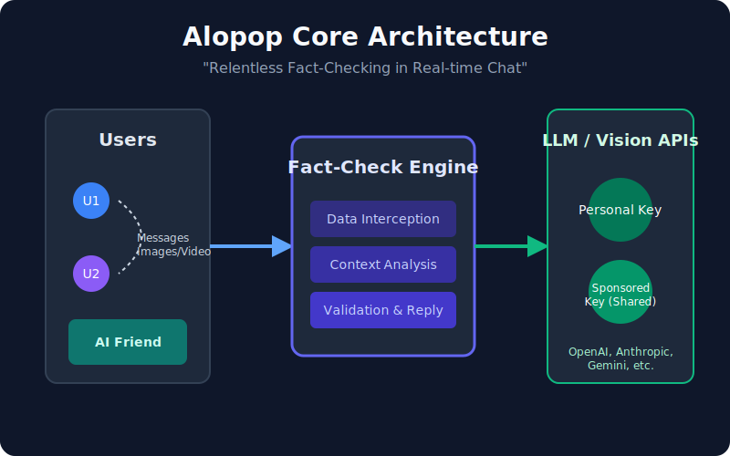
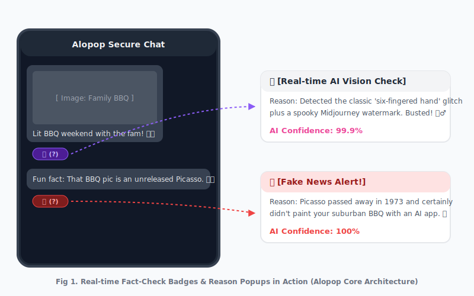
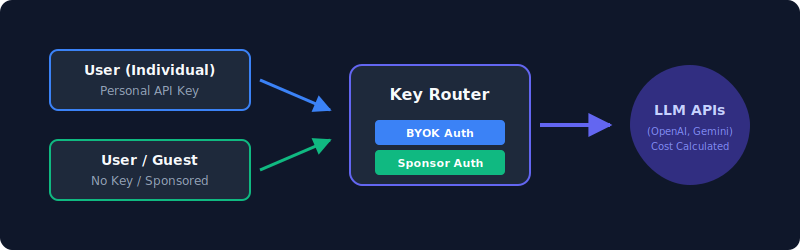
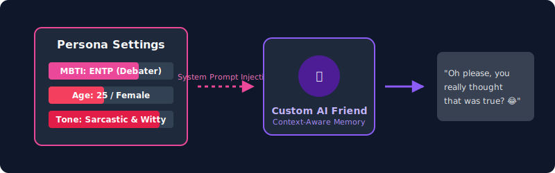
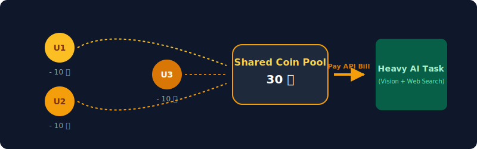
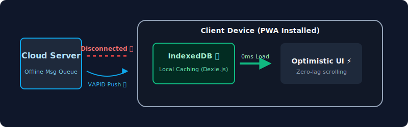

# Alopop (알로팝) - The Fact-Checking Messenger
[🇺🇸 Read in English](./README.md)


**Alopop**은 단순한 실시간 채팅 어플리케이션을 넘어, 대화 속에서 끊임없이 오가는 거짓 정보와 페이크(Fake) 데이터를 실시간으로 검증하기 위해 탄생한 **"팩트체크(Fact-Check) 기반 AI 메신저"**입니다.

---

## 💡 개발 의의 및 핵심 철학 (Core Philosophy)

> **"채팅으로 오가는 모든 데이터(메시지, 이미지, 영상 등)의 팩트(Fact)를 체크한다."**

현대 사회의 메신저는 가짜 뉴스와 허위 정보가 가장 빠르고 은밀하게 퍼져나가는 매개체입니다. Alopop은 이러한 문제를 기술적으로 극복하기 위해, 사용자가 주고받는 대화의 맥락을 AI가 이해하고 웹 검색(DuckDuckGo 등)을 통해 즉각적으로 진실 여부를 판별하는 혁신적인 코어 엔진을 내장하고 있습니다.

### 핵심 차별점 (Why Alopop?)
- **실시간 데이터 교차 검증**: 채팅 중 팩트체크가 필요한 정보(예: 논란이 되는 뉴스, 지식 등)나 이미지 딥페이크(Deepfake)가 등장하면, AI 엔진이 실시간 인터넷 검색 및 비전 분석을 수행하여 진위를 판별하고 채팅 말풍선에 배지(Badge) 형태의 경고를 띄워줍니다.
  <br>
  
  - **🤖 AI 생성 이미지 식별 배지**: 전송된 사진이 생성형 AI에 의해 만들어진 조작 이미지일 확률을 시각화합니다.
  - **🚨 허위 정보 경고 배지**: 가짜 뉴스, 피싱, 왜곡된 사실이 감지되면 즉각적으로 붉은색 경고 배지를 부착하여 피해를 예방합니다.
  - **🔍 실시간 판독 사유 팝업**: 배지를 클릭하면 AI 엔진이 실시간으로 교차 검증한 **구체적인 판정 근거(판정 이유)**와 **팩트체크 확신도(Confidence Score, %)**를 팝업으로 상세히 제공하여 사용자 스스로 정보를 판단할 수 있도록 돕습니다.
- **프라이버시 중심의 No-Log 통신**: 중앙 서버에 대화 내역이 저장되지 않는(No-Log) 소켓 릴레이 방식으로, 사용자의 프라이버시를 완벽에 가깝게 보호합니다.

---

## 🚀 혁신적인 부가 기능 (Features)

Alopop은 팩트체크 코어 엔진 위에서 사용자의 자유도를 극대화하는 다양한 부가 생태계를 제공합니다.

### 1. 무제한 커스텀 API Key 연동 (BYOK & Sponsored)



팩트체크 엔진을 구동하기 위해 플랫폼에 비용을 지불할 필요가 없습니다. LLM(대형 언어 모델)의 비용 주도권과 선택권을 사용자에게 돌려줍니다.
- **BYOK (Bring Your Own Key)**: 사용자 본인이 발급받은 OpenAI, Gemini, Anthropic 등의 API Key를 직접 시스템에 입력하여 자유롭게 기능을 사용할 수 있습니다.
- **Sponsored Key (스폰서 키 제공)**: 개발자나 지인이 서버에 공용 API Key를 스폰서(제공)하면, 키가 없는 일반 사용자들도 고급 팩트체크 및 AI 기능을 제약 없이 누릴 수 있는 생태계가 구축됩니다.

### 2. 초개인화된 나만의 AI 친구 (MBTI Persona Friend)



단순한 깡통 챗봇을 넘어, 대화에 직접 참여하며 철저히 '나'에게 맞춰진 가상의 AI 친구를 창조할 수 있습니다.
- **MBTI 기반 초정밀 페르소나 주입**: 사용자가 **16가지 MBTI 성격 유형, 연령대, 성별, 직업, 특유의 말투**까지 상세하게 설정(System Prompt)하여 세상에 단 하나뿐인 고유한 대화 파트너를 커스터마이징합니다.
- 이 AI 친구는 사용자의 채팅방에 상주하며 오고 가는 대화의 팩트체크를 돕거나, 설정된 MBTI 성격에 맞춰 때로는 딥하게 공감하고 때로는 논리적으로 반박하는 등 맥락에 완벽히 녹아드는 위트 있는 조언을 건넵니다.

### 3. AI 리소스 코인 풀링 경제망 (P2P Coin Pooling)



방장 혼자 AI(API Key) 비용을 감당하는 것이 아니라, 채팅방 내부의 비용 공유 정책을 정교하게 설정할 수 있습니다.
- **P2P Coin Pooling**: 자체 내장된 '가상 지갑(Coin)' 시스템을 통해, 방 참여자들이 십시일반 코인을 더치페이(N빵)하여 AI 컨텍스트 비용을 공동 부담하는 독창적인 웹3(Web3) 스타일 생태계를 갖추었습니다.
- **Individual / Sponsor**: 또한 "각자 부담(자신의 키 사용)" 하거나 "방장 스폰서" 모드 등 완벽한 유연성을 제공합니다.

### 4. Local-First 아키텍처 및 Optimistic UI ⚡



- 단순히 Socket.io 서버에만 의존하는 느린 메신저가 아닙니다.
- **IndexedDB(Dexie.js) 캐싱 엔진**을 내장하여, 메시지 송수신 시 브라우저 로컬 데이터베이스에 선제적으로 저장하고 UI를 즉시 업데이트합니다. 네트워크가 불안정해도 카카오톡 이상의 미친듯한 속도(Blazing Fast)를 보장합니다.

### 5. 완벽한 PWA 및 네이티브 오프라인 푸시 알림 (Web Push) 📲
- **Offline Message Queue**: 앱이 꺼져 있거나 오프라인일 때 전송된 메시지는 서버의 큐(Queue)에 안전하게 보관됩니다.
- **VAPID Web Push**: 사용자가 완전히 종료한 상태에서도 스마트폰의 네이티브(Native) 푸시 알림을 트리거하여 앱 설치 없이도 즉각적인 알림을 받을 수 있습니다.

### 6. 하이브리드 익명/정규 계정 연동 (Soft Onboarding) 🌐
- 가입의 장벽을 완전히 허물었습니다! 처음 접속 시 **게스트(무기명) 상태**로 마음껏 앱을 체험하고 지갑/채팅 기록을 보존합니다.
- 이후 본인이 원할 때 설정의 '하이브리드 계정 연동'을 통해 현재 기기의 익명 데이터를 온전히 들고 정식 유저로 **승급 및 덮어쓰기(Binding)** 기능을 제공합니다.

---

## 🛠 사용 방법 (Getting Started)

### 사전 요구 사항
- [Node.js](https://nodejs.org/) (v18 이상 권장)
- [PostgreSQL](https://www.postgresql.org/) 또는 SQLite 환경 (`prisma/dev.db`)

### 로컬 테스트 환경 구축

1. **저장소 클론 (Clone the repository)**
   ```bash
   git clone git@github.com:Rejard/alopop.git
   cd alopop
   ```

2. **의존성 패키지 설치 (Install dependencies)**
   ```bash
   npm install
   ```

3. **환경 변수 설정 및 DB 초기화**
   프로젝트 루트에 `.env.local`을 만들고 데이터베이스 URL을 설정합니다.
   ```bash
   npx prisma generate
   npx prisma db push
   ```

4. **실행 (Run the application)**
   이 프로젝트는 실시간 소켓 통신을 위해 커스텀 익스프레스 서버(`server.js`)를 래핑하여 구동됩니다.
   ```bash
   npm run dev
   ```
   이후 브라우저에서 `http://localhost:3099`에 접속하여 Alopop의 팩트체크 환경을 체험해 보세요!

---

## 💻 기술 스택 (Tech Stack)
- **Frontend**: Next.js (React 19), Tailwind CSS, Zustand, PWA(Service Worker)
- **Backend**: Node.js, Express, Socket.io (Custom Relay Server)
- **AI & Fact-check**: AI SDK (Google, OpenAI, Anthropic), DuckDuckGo 연동
- **Database**: Prisma ORM, PostgreSQL/SQLite

---

## ⚖️ License (라이선스 및 상업적 이용 안내)

**Alopop**은 개인 개발자, 학생들의 학습 및 비상업적 목적의 오픈소스 생태계 기여를 위해 소스코드를 전면 공개하고 있습니다. 본 프로젝트는 철저한 지적재산권 보호를 위해 **듀얼 라이선스(Dual License) 정책**을 채택하고 있습니다.

### 1. 비상업적 이용 (Non-Commercial & Open Source Use)
오픈소스 커뮤니티와 개인 개발자는 `AGPL-3.0 License` 하에 본 프로젝트의 소스코드를 자유롭게 열람, 수정, 및 비상업적인 용도로 사용할 수 있습니다. 단, 이 코드를 사용하여 발생한 모든 결과물은 동일하게 오픈소스로 공개되어야 합니다.

### 2. 상업적 이용 및 기술 지원 (Commercial Use)
기업, 스타트업, 또는 개인이 **Alopop을 영리적 목적(상용 서비스 제공, 기업 내부 솔루션 통합, 재판매 등)으로 사용하고자 할 경우, AGPL-3.0 라이선스가 적용되지 않도록 반드시 원저작자(Rejard)의 명시적인 사전 동의를 얻고 '상업용 라이선스'를 별도 취득**해야 합니다.

상업적 용도의 서비스 통합이나 엔터프라이즈 환경에서의 전용 기술 지원이 필요하신 경우, 언제든 아래 이메일로 상업용 라이선스(Commercial License) 관련 문의를 남겨주시기 바랍니다.

*상업용 라이선스 계약을 체결하실 경우, 귀사의 독자적인 소스코드를 외부에 공개할 의무가 면제되며 완벽한 기술 지원을 논의할 수 있습니다.*

* 📫 **Commercial & Technical Inquiries:** lemaiii@alonics.com
* **Copyright:** © 2026 Alonics Inc. (주식회사 알로닉스). All Rights Reserved.
